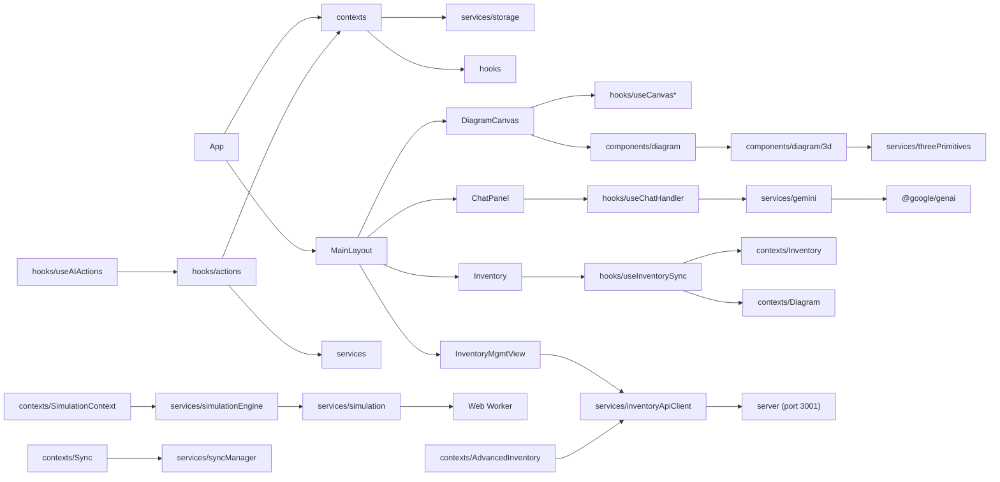

# Project Map -- CircuitMind AI

> Structural navigation index. Generated by /initref on 2026-02-09 (updated).
> This is a MAP -- it tells you where to look, not what things do.

## Directory Structure

```
circuitmind-ai/
├── components/           # 101 React components across 9 subdirectories
│   ├── auth/             # Authentication gates (Gatekeeper, PermissionGuard)
│   ├── dashboard/        # Dashboard widgets (gauges, oscilloscope, heatmap, sparklines)
│   ├── diagram/          # Canvas + diagram system (core rendering)
│   │   ├── 3d/           # Three.js 3D view (LOD, materials, geometry, wire utils)
│   │   ├── canvas/       # Extracted canvas sub-components (minimap, overlays, toolbar, export)
│   │   ├── parts/        # FZPZ parts renderer + breadboard view
│   │   └── wiring/       # Wire routing, trace animator, tooltip
│   ├── inventory/        # Component library UI (list, item, BOM, macros)
│   ├── inventory-mgmt/   # Advanced inventory management (12 components)
│   ├── layout/           # App shell (header, sidebars, overlays, terminals)
│   │   └── assistant/    # AI chat panel + conversation switcher
│   ├── settings/         # Settings sub-panels (7 panels)
│   └── __tests__/        # Component test files (9)
├── contexts/             # 19 React Context providers (state layer)
├── hooks/                # 43 custom hooks + action handlers
│   ├── actions/          # AI action handler registry (6 domain handlers)
│   └── __tests__/        # Hook tests (1)
├── services/             # 86 service files across 13 subdirectories
│   ├── gemini/           # AI integration (client, prompts, parsers + 11 feature modules)
│   │   └── features/     # Per-domain AI features (chat, wiring, BOM, simulation, etc.)
│   ├── simulation/       # MNA circuit simulation engine (10 files)
│   ├── api/              # API gateway, dispatcher, token service, events
│   ├── analytics/        # Project-wide analytics
│   ├── config/           # Runtime configuration manager
│   ├── error/            # Diagnostics hub
│   ├── feedback/         # User correction handling
│   ├── gesture/          # MediaPipe gesture engine + metrics
│   ├── localization/     # i18n + unit conversion
│   ├── logging/          # Audit service
│   ├── search/           # Full-text search indexer (MiniSearch)
│   ├── viz/              # Data visualization engine
│   └── __tests__/        # Service tests (11)
├── server/               # Express 5 + SQLite backend (port 3001)
│   ├── db/               # Database setup + schema
│   ├── middleware/        # CORS, security headers, validation, error handling
│   ├── routes/           # 9 route modules (inventory, catalog, locations, export, etc.)
│   └── services/         # AI identification, vision services, transcriber
├── data/                 # Initial inventory data, tutorial definitions
├── styles/               # Color definitions
├── tests/                # Test setup + utilities (3 files)
├── scripts/              # Build/audit utility scripts (7+)
├── ref/                  # 12 reference docs (architecture, APIs, patterns)
├── docs/                 # Extended documentation (18 subdirectories)
├── conductor/            # Spec-driven dev (product vision, tracks)
├── assets/               # IPC dimension standards
└── public/               # Static assets (UI images, parts SVG, mediapipe WASM)
```

## Module Inventory

### Root Files
| File | LOC | Purpose |
|------|-----|---------|
| App.tsx | ~90 | Root component, 20 nested context providers |
| types.ts | ~300 | All TypeScript interfaces (ActionType, ElectronicComponent, WiringDiagram) |
| index.tsx | -- | React entry point + dev-only axe-core |
| index.css | -- | Global styles + Tailwind + WCAG a11y CSS |

### components/ (top-level)
| File | LOC | Purpose |
|------|-----|---------|
| DiagramCanvas.tsx | 313 | SVG canvas orchestrator (refactored, 6 hooks extracted) |
| MainLayout.tsx | 608 | Root layout orchestrator (refactored, hooks extracted) |
| ComponentEditorModal.tsx | 775 | Multi-tab component editor (lazy loaded) |
| ChatMessage.tsx | 506 | Chat message renderer (9 memoized sub-components) |
| Inventory.tsx | 554 | Component library sidebar |
| SettingsPanel.tsx | 1060 | Settings with 7 sub-panels (lazy loaded) |
| ThreeViewer.tsx | 350 | 3D scene viewer (lazy loaded) |
| ChatPanel.tsx | -- | Chat panel container |
| ConversationSwitcher.tsx | -- | Chat conversation selector |
| AssistantSidebar.tsx | -- | AI assistant sidebar |
| ErrorBoundary.tsx | -- | React error boundary |
| IconButton.tsx | -- | Reusable icon button |

### components/diagram/
| File | LOC | Purpose |
|------|-----|---------|
| Diagram3DView.tsx | 120 | 3D view shell (refactored from ~1950 LOC) |
| DiagramNode.tsx | 1011 | SVG node rendering (complexity hotspot) |
| PinTooltip.tsx | 239 | Pin hover tooltip (voltage, current, state from MNA) |
| componentShapes.ts | 696 | 40+ electronic component shape definitions |
| Wire.tsx | -- | Wire/connection rendering (current-intensity coloring) |
| diagramState.ts | -- | Diagram reducer (undo/redo) |
| PredictiveGhost.tsx | -- | AI-predicted component placement |
| TacticalHUD.tsx | -- | Heads-up display overlay |
| NeuralCursor.tsx | -- | AI-enhanced cursor |
| ConflictResolver.tsx | -- | Merge conflict UI for collaboration |
| DiffOverlay.tsx | -- | Diagram version diff |
| RemoteCursor.tsx | -- | Collaboration remote cursors |
| MismatchMarker.tsx | -- | Component mismatch indicator |

### components/diagram/3d/
| File | Purpose |
|------|---------|
| lodFactories.ts | Level-of-detail 3D component builders (417 LOC) |
| materials.ts | Three.js material definitions (223 LOC) |
| geometryFactories.ts | 3D geometry generators (380 LOC) |
| pinCoordinates.ts | 3D pin position mappings |
| wireUtils.ts | 3D wire routing |
| codeValidation.ts | AI-generated code validation |

### components/diagram/canvas/
| File | Purpose |
|------|---------|
| Canvas2DContent.tsx | Main 2D canvas content renderer (145 LOC) |
| CanvasMinimap.tsx | Diagram minimap overlay |
| CanvasOverlays.tsx | Ghost, cursor, HUD overlays |
| CanvasToolbar.tsx | Canvas tool buttons |
| ExportDialog.tsx | Export format dialog (SVG/PNG/PDF/BOM) |
| SvgDefs.tsx | SVG gradient/filter definitions |
| WireLabelEditor.tsx | Wire label inline editor |
| resolveWireColor.ts | Wire color resolution logic |

### components/inventory-mgmt/ (NEW)
| File | LOC | Purpose |
|------|-----|---------|
| InventoryMgmtView.tsx | 334 | Main inventory management view orchestrator |
| InventoryBrowser.tsx | 454 | Searchable inventory browser with filters |
| InventoryDetail.tsx | 440 | Component detail panel |
| LocationManager.tsx | 551 | Storage location CRUD (bins, shelves, rooms) |
| CaptureWizard.tsx | 628 | Multi-step component capture workflow |
| StockAdjuster.tsx | 274 | Stock quantity adjustments |
| ReviewQueue.tsx | 277 | AI-identified component review queue |
| ExportPanel.tsx | 260 | Export panel (CSV/JSON/PDF) |
| FileUploadCapture.tsx | 217 | File upload for component images |
| WebcamCapture.tsx | 198 | Webcam capture for component identification |
| VoiceRecorder.tsx | 221 | Voice-to-text component entry |
| SyncStatusBar.tsx | 157 | Online/offline sync status indicator |

### components/layout/
| File | Purpose |
|------|---------|
| AppHeader.tsx | Application header bar |
| AppLayout.tsx | Layout structure wrapper |
| ContextMenuOverlay.tsx | Context menu (extracted from MainLayout) |
| OmniSearch.tsx | Global search overlay (focus trap) |
| SecurityReport.tsx | Security audit display |
| SimControls.tsx | Simulation controls (MNA stats: total power, node count) |
| AssistantContent.tsx | AI assistant content panel (175 LOC) |
| HardwareTerminal.tsx | Serial hardware terminal |
| MentorOverlay.tsx | Tutorial mentor overlay |
| BootcampPanel.tsx | Onboarding bootcamp |
| DebugWorkbench.tsx | Debug tools panel |
| AnalyticsDashboard.tsx | Analytics overview |
| CollaboratorList.tsx | Collaboration user list |
| StatusRail.tsx | Status bar rail |
| SystemVitals.tsx | System health display |
| SystemLogViewer.tsx | Log viewer |
| ProjectTimeline.tsx | Project timeline view |
| CommsLog.tsx | Communications log |
| CyberToast.tsx | Themed toast notifications |
| ModeSelector.tsx | Mode switching UI |

### contexts/ (19 providers)
| File | Provider | Domain |
|------|----------|--------|
| LayoutContext.tsx | LayoutProvider | UI layout, sidebars, modes |
| AssistantStateContext.tsx | AssistantStateProvider | AI generation mode, settings |
| HealthContext.tsx | HealthProvider | System health (CPU, memory, FPS) |
| AuthContext.tsx | AuthProvider | Authentication & session |
| UserContext.tsx | UserProvider | User profile & preferences |
| NotificationContext.tsx | NotificationProvider | Toast/alert notifications |
| DashboardContext.tsx | DashboardProvider | Dashboard widget layout |
| MacroContext.tsx | MacroProvider | Action macro recording/playback |
| InventoryContext.tsx | InventoryProvider | Component library (source of truth) |
| AdvancedInventoryContext.tsx | AdvancedInventoryProvider | Catalog/location-aware inventory (server-backed) |
| SyncContext.tsx | SyncProvider | Cross-device sync state |
| ConversationContext.tsx | ConversationProvider | Chat sessions |
| DiagramContext.tsx | DiagramProvider | Diagram state + undo/redo |
| SelectionContext.tsx | SelectionProvider | Multi-select state |
| TelemetryContext.tsx | TelemetryProvider | Event tracking |
| HUDContext.tsx | HUDProvider | HUD content |
| SimulationContext.tsx | SimulationProvider | Circuit simulation (async MNA) |
| VoiceAssistantContext.tsx | VoiceAssistantProvider | Voice I/O, live audio |
| TutorialContext.tsx | TutorialProvider | Tutorial progression |

### hooks/ (43 files)
| File | Purpose |
|------|---------|
| useAIActions.ts | Action dispatch hub (getHandler -> execute -> audit) |
| useConversations.ts | Conversation CRUD + IndexedDB persistence (349 LOC) |
| useInventorySync.ts | Inventory->diagram auto-sync (225 LOC) |
| useAutonomySettings.ts | AI action auto-execution settings |
| useCanvasInteraction.ts | Canvas drag/zoom/pan handlers |
| useCanvasLayout.ts | Canvas layout computation |
| useCanvasWiring.ts | Wire creation/editing on canvas |
| useCanvasExport.ts | Canvas PNG/SVG export |
| useCanvasHighlights.ts | Component highlighting |
| useCanvasHUD.ts | HUD content management |
| useChatHandler.ts | Chat message send/receive (279 LOC) |
| useEditorFormState.ts | Component editor form state |
| useEditorAIChat.ts | Editor AI chat sidebar (215 LOC) |
| useEditorModalHandlers.ts | Editor modal action handlers (208 LOC) |
| useMainLayoutActions.ts | Main layout action dispatch (219 LOC) |
| useKeyboardShortcuts.ts | Global keyboard shortcut dispatch |
| useGestureTracking.ts | MediaPipe gesture handling (211 LOC) |
| useNeuralLinkEffects.ts | Neural Link lifecycle |
| useAIContextBuilder.ts | AI context building + predictions |
| useSearchIndex.ts | MiniSearch indexing |
| useSecurityAudit.ts | Security audit loop |
| useFocusTrap.ts | Modal focus trap (123 LOC) |
| useDiagram3DScene.ts | 3D scene setup/teardown (377 LOC) |
| useDiagram3DSync.ts | 3D<->2D diagram sync (243 LOC) |
| useDiagram3DTelemetry.ts | 3D telemetry events |
| useInventoryApi.ts | Inventory REST API client hook |
| useOfflineSync.ts | Offline sync queue management |
| useVoiceRecorder.ts | Voice recording hook (139 LOC) |
| useWebcam.ts | Webcam capture hook (131 LOC) |
| useActionHistory.ts | Undo/redo stack |
| useSync.ts | Sync state hook |
| useClickOutside.ts | Click-outside detection |
| useHoverBehavior.ts | Hover intent detection |
| useResizeHandler.ts | Resize observer |
| useConnectivity.ts | Online/offline detection |
| useNeuralLink.ts | Neural Link state |
| usePermissions.ts | Permission checks |
| useToast.tsx | Toast notification hook |
| actions/index.ts | Handler registry + getHandler() |
| actions/diagramHandlers.ts | add/remove component, create/remove connection |
| actions/canvasHandlers.ts | highlight, centerOn, zoom, pan, resetView |
| actions/navHandlers.ts | open/close panels, switch modes |
| actions/appControlHandlers.ts | undo, redo, save, load, analyzeVisuals |
| actions/types.ts | Handler type definitions |

### services/simulation/ (NEW — MNA engine)
| File | LOC | Purpose |
|------|-----|---------|
| types.ts | 182 | CircuitNode, NetlistEntry, MNAResult, ComponentModel interfaces |
| mnaSolver.ts | 211 | Gaussian elimination with partial pivoting |
| mnaMatrixAssembler.ts | 330 | Matrix construction from component stamps |
| mnaGraphBuilder.ts | 280 | Union-find net builder (WiringDiagram → netlist) |
| mnaResultFormatter.ts | 268 | Extract voltages/currents, map to pin states |
| mnaErrorDetector.ts | 256 | Post-solve warnings (overcurrent, floating, shorts) |
| componentValueExtractor.ts | 483 | 30+ regex patterns for component → electrical properties |
| simulationWorker.worker.ts | 148 | Web Worker entry point |
| simulationWorkerBridge.ts | 178 | Main thread ↔ worker messaging |
| workerTypes.ts | 62 | Worker message type definitions |

### services/gemini/ (16 files)
| File | Purpose |
|------|---------|
| client.ts | Gemini API singleton (15 model constants) |
| types.ts | Request/response schemas |
| prompts.ts | Prompt templates |
| parsers.ts | Response extraction utilities |
| contextLimits.ts | Token limit handling + overflow detection (149 LOC) |
| index.ts | Re-exports |
| features/chat.ts | Chat completion |
| features/wiring.ts | Wiring diagram generation (uses Pro) |
| features/components.ts | Component identification (smart fill, part finder) |
| features/bom.ts | Bill of materials generation |
| features/simulation.ts | Circuit simulation prompts |
| features/predictions.ts | Predictive component placement |
| features/suggestions.ts | Proactive suggestions |
| features/hud.ts | HUD content generation |
| features/datasheets.ts | Datasheet extraction |
| features/media.ts | Image/video generation (Imagen, Veo) |
| features/versioning.ts | Diagram version comparison |

### services/ (root, ~50 files)
| File | LOC | Purpose |
|------|-----|---------|
| storage.ts | 324 | Dual persistence: localStorage + IndexedDB |
| componentValidator.ts | 502 | Inventory<->diagram consistency |
| threePrimitives.ts | 1257 | 3D shape generators (complexity hotspot) |
| simulationEngine.ts | ~260 | MNA facade: delegates to simulation/ pipeline |
| exportService.ts | 408 | Unified export (SVG/PNG/PDF/BOM-CSV/BOM-JSON) |
| captureService.ts | 140 | Component capture/identification service |
| inventoryApiClient.ts | 226 | REST API client for server backend |
| offlineQueue.ts | 158 | Offline action queue with sync |
| syncManager.ts | 131 | Cross-device sync orchestration |
| aiContextBuilder.ts | -- | Build AI context from app state |
| aiMetricsService.ts | -- | AI latency/success tracking |
| responseParser.ts | -- | Parse AI responses (mentions, actions, code blocks) |
| geminiService.ts | -- | Legacy Gemini wrapper |
| authService.ts | -- | Authentication service |
| collabService.ts | -- | Yjs collaboration manager |
| webRTCService.ts | -- | WebRTC signaling |
| predictionEngine.ts | -- | Component prediction ML |
| threeCodeValidator.ts | -- | AI-generated Three.js code sandbox |
| threeCodeRunner.ts | -- | Three.js code execution |
| fzpzLoader.ts | -- | Fritzing parts loader |
| gitService.ts | -- | In-browser Git (isomorphic-git) |
| healthMonitor.ts | -- | System health monitoring |
| bomService.ts | -- | BOM export (CSV, PDF) |
| macroEngine.ts | -- | Action macro recording/playback |
| ragService.ts | -- | Retrieval-augmented generation |
| serialService.ts | -- | Web Serial API for hardware |
| standardsService.ts | -- | IPC/electronics standards |
| securityAuditor.ts | -- | Security vulnerability scanning |
| liveAudio.ts | -- | Live audio streaming |
| circuitAnalysisService.ts | -- | Circuit analysis |

### server/ (NEW — Express + SQLite backend)
| File | LOC | Purpose |
|------|-----|---------|
| index.ts | 101 | Express app setup, middleware, route registration |
| db/database.ts | 28 | SQLite connection + initialization |
| db/schema.sql | 86 | Table definitions (inventory, catalog, locations, stock_moves) |
| middleware/cors.ts | 12 | CORS configuration |
| middleware/securityHeaders.ts | 23 | Security headers (CSP, HSTS, etc.) |
| middleware/validation.ts | 44 | Request validation middleware |
| middleware/errorHandler.ts | 19 | Global error handler |
| routes/inventory.ts | 186 | CRUD for inventory items |
| routes/catalog.ts | 197 | Component catalog management |
| routes/locations.ts | 211 | Storage location CRUD |
| routes/stockMoves.ts | 111 | Stock movement tracking |
| routes/export.ts | 133 | Export endpoints (CSV/JSON/PDF) |
| routes/identify.ts | 150 | AI component identification |
| routes/search.ts | 56 | Full-text search endpoint |
| routes/migrate.ts | 83 | Frontend→backend data migration |
| routes/stt.ts | 32 | Speech-to-text endpoint |
| services/aiIdentifier.ts | 54 | AI identification orchestrator |
| services/geminiVision.ts | 114 | Gemini Vision API integration |
| services/claudeVision.ts | 115 | Claude Vision API integration |
| services/transcriber.ts | 17 | Audio transcription service |

## Dependency Graph



Plaintext fallback:
- `App.tsx` depends on: `contexts/*`, `components/MainLayout`
- `contexts/*` depends on: `services/storage`, `hooks/*`
- `MainLayout` depends on: `DiagramCanvas`, `Inventory`, `ChatPanel`, `InventoryMgmtView`, `layout/*`
- `DiagramCanvas` depends on: `hooks/useCanvas*` (6 hooks), `components/diagram/*`
- `components/diagram/3d/` depends on: `three`, `services/threePrimitives`
- `hooks/useAIActions` depends on: `hooks/actions/*`, `contexts/*`, `services/*`
- `hooks/useChatHandler` depends on: `services/gemini/features/chat`
- `hooks/useInventorySync` depends on: `contexts/Inventory`, `contexts/Diagram`
- `services/gemini/*` depends on: `@google/genai`
- `services/collabService` depends on: `yjs`, `y-webrtc`, `services/webRTCService`
- `services/simulationEngine` depends on: `services/simulation/*` (MNA pipeline)
- `services/simulation/simulationWorkerBridge` depends on: Web Worker (`simulationWorker.worker.ts`)
- `services/inventoryApiClient` depends on: `server/` (Express backend, port 3001)
- `contexts/AdvancedInventoryContext` depends on: `services/inventoryApiClient`
- `contexts/SyncContext` depends on: `services/syncManager`

## Test Coverage Map

| Directory | Source Files | Test Files | Coverage |
|-----------|-------------|-----------|----------|
| components/ | 101 | 9 | 9% |
| hooks/ | 43 | 1 | 2% |
| services/ | 86 | 11 | 13% |
| contexts/ | 19 | 0 | 0% |
| server/ | 19 | 0 | 0% |
| tests/ (root) | -- | 3 | -- |
| **Total** | **268** | **24** | **9%** |

Low test coverage across the board. Be extra careful with contexts/ (zero tests), hooks/ (1 test for 43 hooks), and server/ (zero tests). Services now have the best relative coverage (11 test files including MNA solver tests).
